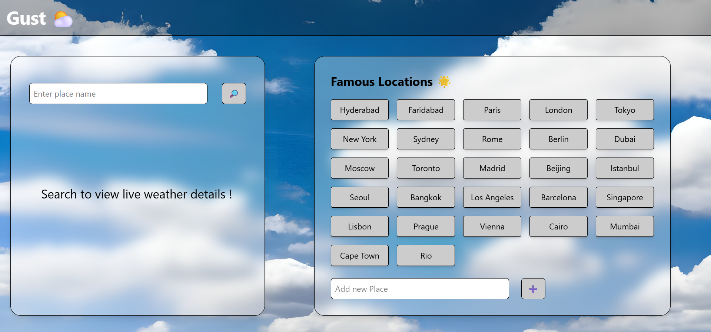

### 🌬️ Gust - Weather App

Gust is a sleek and responsive weather application built using React, Next.js, and Tailwind CSS. It provides live weather updates such as temperature, wind speed, and status icons for cities worldwide — all presented in a clean, modern UI with smooth interactivity.

### 🖼️ Preview

### 🚀 Features

#### 🔍 Live Weather Data
Enter any city to instantly fetch real-time temperature, wind speed, and weather conditions with intuitive icons.

#### 🌟 Famous Locations
A curated list of globally recognized cities is preloaded for quick access — get weather details with a single click.

#### ➕ Custom Locations
Users can add their own frequently visited or favorite cities. These are stored locally and persist even after reloads for ease of reuse.

#### 🎨 Beautiful UI with Backdrop Blur
Uses modern backdrop blur effects and subtle transparency to create a smooth and elegant interface.

### 🛠️ Tech Stack

| Technology | Purpose |
| ------------------- | ------------------------------- |
| **React** | Component-based UI building |
| **Next.js** | Server-side rendering & routing |
| **Tailwind CSS** | Utility-first CSS styling |
| **OpenWeather API** | Weather data integration |

### 📦 Getting Started

#### 1. Clone the Repository
git clone https://github.com/yourusername/gust-weather-app.git
cd gust-weather-app

#### 2. Install Dependencies
npm install

#### 3. Add API Key
Replace the APIkey in your WeatherApp.jsx with your OpenWeatherMap API Key.
const APIkey = "your_api_key_here";

#### 4. Run the App
npm run dev
Visit http://localhost:3000 in your browser to view the app.
